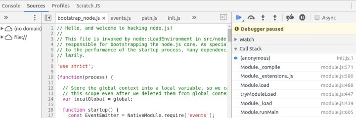

本文将使用[Debugging the Main Process | Electron](https://electronjs.org/docs/tutorial/debugging-main-process)中的方法，进行主线程的调试，主要介绍了node启动electron app入口脚本前后的时序。 

## 一、准备知识，如对electron 已了解，请略过

阅读本文前需要了解electron基本概念，可参见：[Quick Start | Electron](https://electronjs.org/docs/tutorial/quick-start)  

Electron通过将Chromium和Node.js合并到同一个运行时环境中，利用HTML，CSS和JavaScript来构建跨平台桌面应用程序。  

由于基于node环境，因此所有 Node. js 的内置模块 都可用在 Electron中运行。   

主流程 vs 渲染流程 脚本的概念，请参见：[Electron Application Architecture | Electron](https://electronjs.org/docs/tutorial/application-architecture#main-and-renderer-processes)  

主进程脚本就像一个普通的Node. js 脚本:
```javascript
const {app, BrowserWindow} = require('electron')
  let win = null
  
  app.on('ready', () => {
    win = new BrowserWindow({width: 800, height: 600})
    win.loadURL('https://github.com')
  })
```
渲染进程除了额外能够使用node模块的能力外，与普通网页没有什么区别
```html
<!DOCTYPE html>
  <html>
  <body>
  <script>
    const {app} = require('electron').remote
    console.log(app.getVersion())
  </script>
  </body>
  </html>
```
## 二、时序图 - node启动electron app入口脚本前后

1) 图片不清楚，查看原图请点击：`https://raw.githubusercontent.com/opennext/note/master/electronjs/sequences/electron_runtime_sequence_1.png` 。
2) 本图以 [electron/electron-quick-start](https://github.com/electron/electron-quick-start) 为例。


从图中可以看出，主要过程如下：

- 运行行electron命令启动app后，node-core进行启动：http://node.cc加载bootstrap_node.js 

- bootstrap_node.js中的startup会运行node的模块管理（module.js）: 后续加载node模块的过程，可以大致知道node模块管理工具对node内置模块、electron模块进行加载，主要过程包括：判断模块类型、加载物理文件、compiledWrapper处理、缓存模块等。

- 通过调试可以得到加载过很多模块，如：
```
/usr/local/lib/node_modules/electron/dist/resources/electron.asar/browser/api/app.js
/usr/local/lib/node_modules/electron/dist/resources/electron.asar/browser/api/browser-window.js
```
- node在加载了init.js模块时，就进入了electron的逻辑代码：
```
/usr/local/lib/node_modules/electron/dist/resources/electron.asar/browser/init.js
```

- init.js主要工作是：加载app的`package.json`, `main.js`等。 可以发现这时并没有加载我们的示例程序electron-quick-start的上述文件。此时加载的是electron源码中的`/usr/local/lib/node_modules/electron/dist/resources/default_app.asar/package.json`

- 上述default_app被加载后，做了一些工作, 设置默认app name，默认菜单等。

- 而后，`main.js(default_app): loadApplicationPackage`才开始去调用示例app的逻辑
加载并执行`main.js` -> .../demos/electron-quick-start：
1)packageJson: override app name/version
2)Run the app

- 通过electron.app模块，注册app事件：
```
on('ready',createWindow_CB)
on('window-all-closed', ...)
on('activate',...)
```

- `EventEmitter`负责监听事件并emit回调

- app窗口由BrowserWindow创建：`lib\browser\api\browser-window.js`，详细机制本文不表。

## 三、调试过程

主进程调试官方文档：Debugging the Main Process | Electron 
在linux环境下，以 electron/electron-quick-start 为例进行调试：

1. 在`electron-quick-start`目录下，执行： `electron-quick-start$ electron --inspect-brk=3002 .` ，得到提示：
```
Debugger listening on port 3002.
Warning: This is an experimental feature and could change at any time.
To start debugging, open the following URL in Chrome:
   chrome-devtools://devtools/bundled/inspector.html?experiments=true&v8only=true&ws=127.0.0.1:3002/01136b47-7148-463a-8a5c-a6abcb970b63
```
2. chrome中打开上一步uri，得到调试界面

