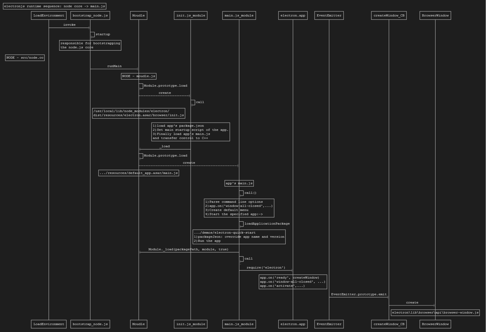

# electron runtime sequence

## part 1. from node core to main.js  

#### how to edit the diagram
- install vs code plugin vscode-sequence-diagrams
- open file **electron_runtime_sequence - from node core to main.js.seqdiag** in vscode
- run Command `Show Sequence Diagram Preview`  

## part 2. BrowserWindow  
TODO